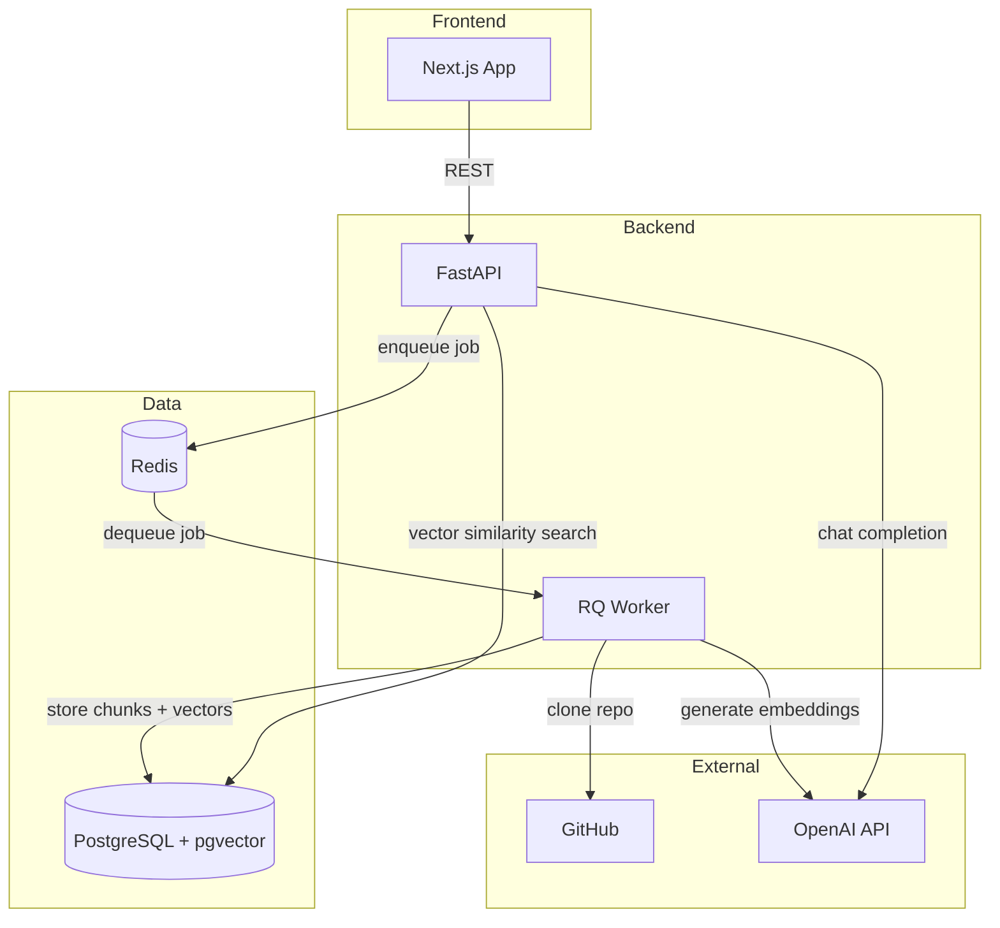
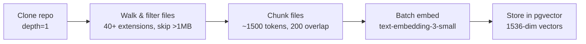
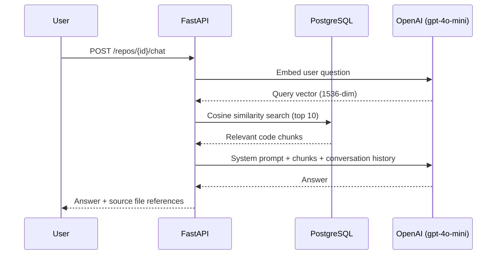
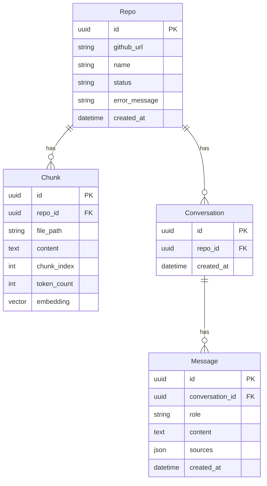

# CodeRecall

Chat with any GitHub repository using RAG (Retrieval-Augmented Generation). Point it at a repo, wait for ingestion, then ask questions about the codebase in natural language.

Built as an AI engineering learning project exploring embeddings, vector databases, and LLM context augmentation.

## Architecture



## Ingestion Pipeline



1. **Clone** — shallow clone via GitPython to a temp directory
2. **Filter** — whitelist of 40+ code/config/doc extensions; skips lock files and files >1MB
3. **Chunk** — token-aware splitting (tiktoken, `cl100k_base`) on line boundaries with overlap
4. **Embed** — batched OpenAI calls (max 100K tokens/batch) with exponential backoff
5. **Store** — bulk insert chunks + embeddings into PostgreSQL; update repo status to `ready`

The entire pipeline runs as a background job (Redis + RQ, 30min timeout) so the API returns immediately.

## RAG Query Flow



## Tech Stack

| Layer | Technology |
|-------|-----------|
| Frontend | Next.js 16 (App Router), React 19, TypeScript, Tailwind CSS 4, Framer Motion |
| Backend | Python 3.11+, FastAPI, Uvicorn |
| Database | PostgreSQL 16 + pgvector extension |
| Queue | Redis 7 + RQ (Redis Queue) |
| AI | OpenAI API — `gpt-4o-mini` (chat), `text-embedding-3-small` (embeddings) |
| Migrations | Alembic |

## Project Structure

```
CodeRecall/
├── backend/
│   ├── app/
│   │   ├── main.py              # FastAPI entry point
│   │   ├── config.py            # Pydantic settings
│   │   ├── database.py          # SQLAlchemy engine & sessions
│   │   ├── models.py            # ORM models (Repo, Chunk, Conversation, Message)
│   │   ├── schemas.py           # Request/response schemas
│   │   ├── worker.py            # RQ worker process
│   │   ├── routers/
│   │   │   ├── repos.py         # Repo CRUD + ingestion trigger
│   │   │   └── chat.py          # Chat & conversation endpoints
│   │   └── services/
│   │       ├── ingestion.py     # Clone, chunk, embed pipeline
│   │       ├── embeddings.py    # OpenAI embedding wrapper
│   │       └── retrieval.py     # RAG search & LLM chat
│   ├── alembic/                 # DB migrations
│   ├── requirements.txt
│   └── Dockerfile
├── frontend/
│   ├── src/app/
│   │   ├── page.tsx             # Home — repo list & add form
│   │   └── repos/[id]/chat/
│   │       └── page.tsx         # Chat interface
│   ├── src/lib/api.ts           # API client
│   ├── package.json
│   └── Dockerfile
└── docker-compose.yml
```

## Getting Started

### Prerequisites

- Docker & Docker Compose
- An [OpenAI API key](https://platform.openai.com/api-keys)

### Setup

1. **Clone the repo**
   ```bash
   git clone https://github.com/your-username/CodeRecall.git
   cd CodeRecall
   ```

2. **Configure environment** — create a `.env` file in the project root:
   ```env
   OPENAI_API_KEY=sk-proj-...

   POSTGRES_USER=coderecall
   POSTGRES_PASSWORD=coderecall
   POSTGRES_DB=coderecall
   DATABASE_URL=postgresql://coderecall:coderecall@db:5432/coderecall

   REDIS_URL=redis://redis:6379/0

   BACKEND_CORS_ORIGINS=["http://localhost:3000"]
   CLONE_DIR=/tmp/cloned_repos
   ```

3. **Start everything**
   ```bash
   docker-compose up --build
   ```

4. **Access the app**
   - Frontend: [http://localhost:3000](http://localhost:3000)
   - API docs (Swagger): [http://localhost:8000/docs](http://localhost:8000/docs)

### Local Development (without Docker)

```bash
# Start Postgres (with pgvector) and Redis
docker run -d --name postgres -e POSTGRES_USER=coderecall -e POSTGRES_PASSWORD=coderecall -e POSTGRES_DB=coderecall -p 5432:5432 pgvector/pgvector:pg16
docker run -d --name redis -p 6379:6379 redis:7-alpine

# Backend
cd backend
pip install -r requirements.txt
alembic upgrade head
uvicorn app.main:app --reload

# Worker (separate terminal)
cd backend
python -m app.worker

# Frontend (separate terminal)
cd frontend
npm install
npm run dev
```

## API Reference

### Repositories

| Method | Endpoint | Description |
|--------|----------|-------------|
| `POST` | `/repos` | Add a GitHub repo (starts async ingestion) |
| `GET` | `/repos` | List all repos |
| `GET` | `/repos/{id}` | Get repo details + status |
| `DELETE` | `/repos/{id}` | Delete repo and all its data |

### Chat

| Method | Endpoint | Description |
|--------|----------|-------------|
| `POST` | `/repos/{id}/chat` | Send a message (returns answer + sources) |
| `GET` | `/repos/{id}/conversations` | List conversations for a repo |
| `GET` | `/conversations/{id}` | Get full conversation history |

### Health

| Method | Endpoint | Description |
|--------|----------|-------------|
| `GET` | `/health` | Health check |

## Data Models



## Key Design Decisions

- **Async ingestion** — cloning and embedding large repos can take minutes, so it runs as a background job via Redis + RQ with a 30-minute timeout
- **Token-aware chunking** — splits on line boundaries at ~1500 tokens with 200-token overlap to preserve context across chunk boundaries
- **Batched embeddings** — groups chunks into batches of max 100K tokens with exponential backoff for rate limits
- **pgvector cosine search** — uses PostgreSQL's `<=>` operator for vector similarity, returning top-10 chunks per query
- **Conversation history** — passes up to 10 previous messages to the LLM for follow-up questions
